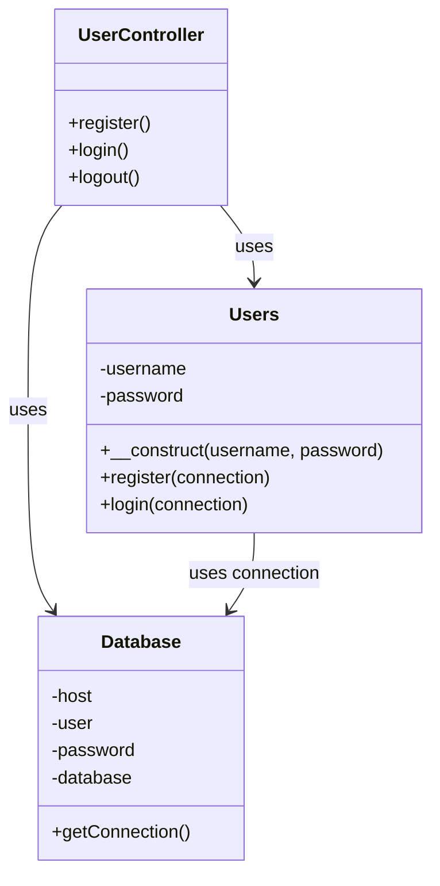
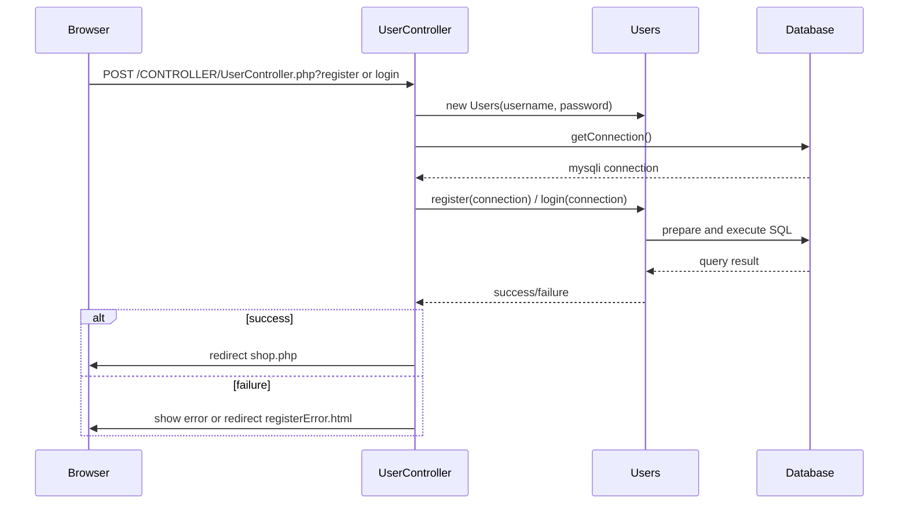

# myweb2

## Overview

`myweb2` is a simple PHP web application for user authentication and session-based shopping cart flow. The project contains:

- `CONTROLLER/UserController.php` — handles registration, login, and logout actions.
- `MODEL/Users.php` — defines the `Users` model with registration and login methods.
- `MODEL/db.php` — defines the `Database` class for MySQL connection management.
- `VIEW/` — contains HTML and PHP pages for login, registration, shopping, and general navigation.

## Project Structure

- `CONTROLLER/`
  - `UserController.php`
- `MODEL/`
  - `Users.php`
  - `db.php`
- `VIEW/`
  - `login.html`
  - `register.html`
  - `registerError.html`
  - `shop.php`
  - `home.php`
  - `checkout.php`
- `aboutus.html`
- `index.html`

## How it works

1. The user submits the registration form (`register.html`) or login form (`login.html`).
2. `UserController` receives the request and creates a `Users` model instance.
3. The controller uses `Database` to open a connection to MySQL.
4. The `Users` model runs the SQL logic:
   - `register()` inserts a new user with a hashed password.
   - `login()` fetches the hashed password and verifies credentials.
5. On success, session variables are initialized and the user is redirected to `VIEW/shop.php`.
6. `logout()` clears the session and redirects back to `VIEW/login.html`.

## Mermaid Diagrams

### Class Diagram

### Sequence Diagram

## Notes

- Database credentials are configured in `MODEL/db.php`.
- Make sure the MySQL database `BBDDTransversal` exists and includes a `users` table.
- Passwords are secured using `password_hash()` and verified with `password_verify()`.
